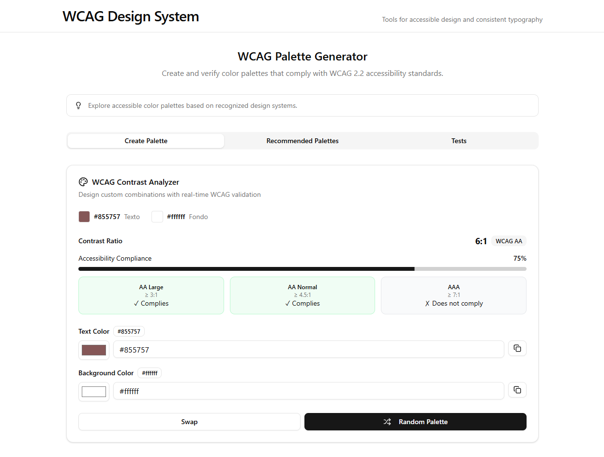

# WCAG Design System

A comprehensive color palette generator and accessibility testing tool designed to help developers and designers create WCAG 2.2 compliant color combinations for web applications.



## Overview

This tool provides an intuitive interface for generating, testing, and validating color palettes that meet Web Content Accessibility Guidelines (WCAG) standards. It features real-time contrast ratio calculations, accessibility compliance checking, and a curated collection of expert-recommended color combinations.

## Features

### Color Palette Generator
- **Real-time WCAG Validation**: Instant feedback on contrast ratios and compliance levels
- **Custom Color Creation**: Interactive color pickers with hex input support
- **Accessibility Scoring**: Visual progress indicators showing compliance percentage
- **Smart Recommendations**: Contextual suggestions for improving color accessibility

### Pre-defined Palettes
- **Expert-Curated Collections**: Government and corporate design system palettes
- **Categorized by Style**: Warm neutrals, modern pastels, and professional themes
- **Verified Compliance**: All palettes tested for WCAG 2.1 AA standards
- **One-click Application**: Easy integration with copy-to-clipboard functionality

### Testing Environment
- **Live Preview**: See how colors perform with different text sizes
- **Multiple Compliance Levels**: AA and AAA standard verification
- **Detailed Analysis**: Comprehensive breakdown of accessibility metrics
- **Usage Guidelines**: Recommendations for normal and large text applications

## Technical Specifications

### WCAG Compliance Levels
- **AA Large Text**: Minimum 3:1 contrast ratio
- **AA Normal Text**: Minimum 4.5:1 contrast ratio
- **AAA Standard**: Minimum 7:1 contrast ratio for enhanced accessibility

### Supported Color Formats
- Hexadecimal color codes (3 and 6 digit)
- RGB color space calculations
- Luminance-based contrast algorithms

## Technology Stack

- **Frontend**: React 19 with TypeScript
- **UI Framework**: Shadcn/UI components with Tailwind CSS
- **Build Tool**: Vite for fast development and building
- **Accessibility**: WCAG 2.2 compliance algorithms
- **State Management**: React hooks for real-time updates

## Installation

1. Clone the repository:
```bash
git clone <repository-url>
cd wcag_design
```

2. Install dependencies:
```bash
npm install
```

3. Start the development server:
```bash
npm run dev
```

4. Open your browser and navigate to `http://localhost:5173`

## Usage

### Creating Custom Palettes
1. Navigate to the "Create Palette" tab
2. Use color pickers or input hex values directly
3. View real-time contrast ratio calculations
4. Check compliance indicators for different text sizes
5. Apply recommendations to improve accessibility

### Using Pre-defined Palettes
1. Go to "Recommended Palettes" tab
2. Browse categories (Warm Neutrals, Modern Pastels, etc.)
3. Click on any palette to apply it instantly
4. Copy color codes for use in your projects

### Testing Accessibility
1. Select the "Testing" tab
2. View live previews with different text sizes
3. Analyze detailed compliance reports
4. Export results for documentation

## Color Palette Categories

### Warm Neutrals
Earthy, professional tones suitable for corporate and government applications.

### Modern Pastels
Contemporary soft colors perfect for modern web applications and user interfaces.

### Professional Themes
High-contrast combinations optimized for business and enterprise environments.

## Accessibility Features

- **Keyboard Navigation**: Full keyboard accessibility support
- **Screen Reader Compatible**: Semantic HTML and ARIA labels
- **High Contrast Mode**: Enhanced visibility options
- **Responsive Design**: Works across all device sizes

## Contributing

This is a personal project, but suggestions and feedback are welcome. Please ensure any proposed changes maintain WCAG compliance standards.

## License

This project is for personal and educational use. Please respect accessibility guidelines when using these tools in production environments.

## Resources

- [WCAG 2.2 Guidelines](https://www.w3.org/WAI/WCAG22/quickref/)
- [WebAIM Contrast Checker](https://webaim.org/resources/contrastchecker/)
- [Color Universal Design](https://jfly.uni-koeln.de/color/)

## Acknowledgments

Built with modern web technologies and accessibility best practices to support inclusive design in web development.